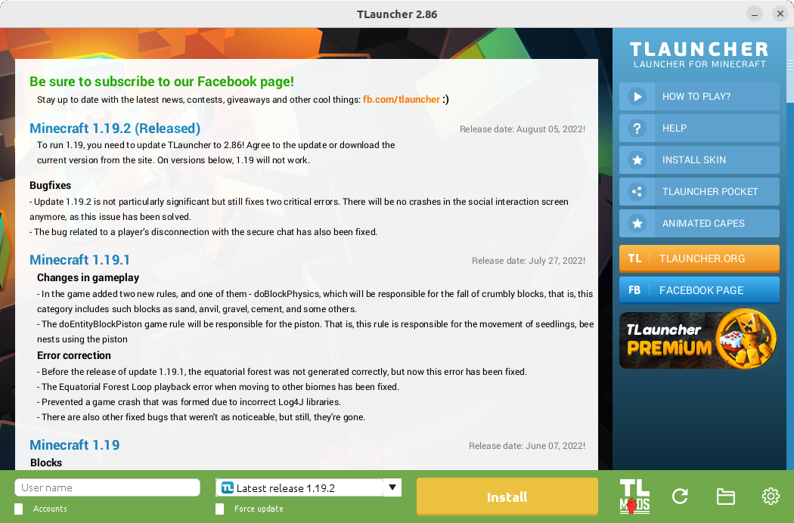

# TLauncher Flatpak



## Installation

- Make sure you have `flatpak` installed (`sudo apt install flatpak`)
- Download latest version from [releases](https://github.com/zocker-160/org.tlauncher.TLauncher/releases)
- Open using `Software Installer` on GNOME or `Discover` on KDE \
OR using command line: `flatpak install [--user] ./TLauncher.flatpak`

## Build from Manifest

In case you don't trust my local flatpak package, you can also build it yourself:

- Make sure you have `flatpak-builder` installed (`sudo apt install flatpak-builder`)
- Clone this repository
```bash
git clone https://github.com/zocker-160/org.tlauncher.TLauncher.git
cd org.tlauncher.TLauncher
```
- Run builder and install any potentially missing runtimes
```bash
flatpak-builder --force-clean build/ --user --install org.tlauncher.TLauncher.yml
```
- If successful you should have a TLauncher entry in your start menu

## NOTE

The local flatpak build does not violate TLauncher's terms, which prohibit redistribution, because the `.flatpak` does not actually contain TLauncher itself.

The TLauncher `.jar` will get downloaded during the installation by the user's machine from the official download url. [^1]

[^1]: see flatpak's [documentation](https://docs.flatpak.org/en/latest/conventions.html?highlight=extra-data#exporting-through-extra-data) on the `extra-data` flag
